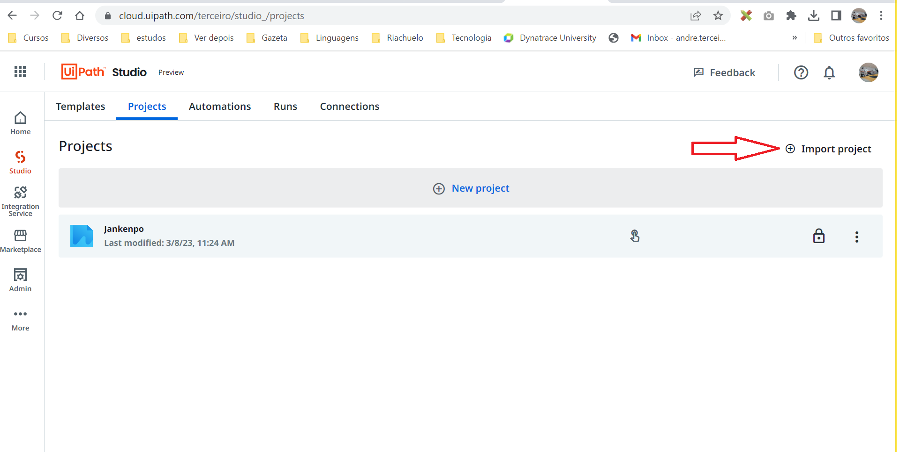

# jankenpo-uipath

With UI PATH you can build a programming project using the "low code" idea, putting the things in boxes. You still continue needing to have the logic mind, you only willn't insert text of code. Istead of this, you will use boxes.

To use this project you will need to import the project in UI PATH project manager page, as you can see in the image bellow:

The file to import is "**Jankenpo.uip**" that is in the root directory of this repository.

I used some very simple HTML files in my website and I versioned this files in the "**jankenpo-external**" directory.

[Video showing the execution.](https://youtu.be/x4Oi1PC6cwk)